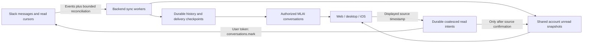

# Slack synchronization: ownership, limits and release acceptance

Slack owns source messages and the user's source read cursor. The backend owns
durable import work, verified coverage, delivery retries and one account-scoped
read-state projection. Web, desktop and iOS render that projection. A local
device's arrival order or optimistic read attempt must not redefine source unread
state.

## Implemented contract

- The selected private history window remains 7 or 30 days (or explicit existing
  all-history consent). Public repair is bounded to the most recent 30 days.
  Both requests and returned rows must satisfy bounds. Older thread roots must
  not prevent in-window replies from known threads being repaired.
- Source event ingestion continues independently of backfill. Durable cursors,
  idempotent source identities, deletion handling and generation fences remain
  authoritative across restarts and concurrent source/history delivery.
- History work rotates workspaces, then owners, then conversations and lanes.
  Shared public channels form one owner group. A large account cannot receive a
  separate owner turn for each of its conversations.
- Source unread snapshots are collected while clients are closed. Client polls
  read the same owner/consent/OAuth scoped cache; they do not independently fetch
  Slack or add unread counts from their partially received message timelines.
- A read request is persisted before provider I/O. Requests coalesce to the
  highest requested source timestamp. The worker retries after app exit and
  checks the requesting device and consent again. Pending or failed requests
  never masquerade as a Slack-confirmed read.
- A confirmed read publishes one shared snapshot immediately, including
  `confirmed_at`. Partial reads have an unknown remaining numeric count until
  a source refresh establishes it. Older in-flight snapshots cannot undo the
  confirmation. Missing cache entries are not evidence that a channel was read
  or revoked; the explicit authorized target set controls removal.
- Existing owner-private delivery and membership fences remain in force.
  No token, message body or profile is stored in read-intent checkpoints.
- Device recovery prioritizes known, recently active conversations whose old
  room was fenced. Each fair discovery turn can restore one such conversation
  before continuing the historical directory cursor. Recovery rechecks Slack
  access and membership and uses only currently verified devices. It preserves
  the account/source read snapshot across room replacement, but publication
  still waits for the replacement room's bounded history coverage. A failed
  room cannot block recovery of all other recent rooms.

## Timing objectives and capacity

The requested initial-import objective is **within two hours**, with useful
recent conversations becoming ready earlier. This is a service objective to
measure, not an unconditional guarantee for arbitrary Slack accounts.

For the verified internal/Marketplace configuration, history and replies each
have a conservative 50-request/minute allowance. Conversation info, directory
listing and read-marker writes also use 50/minute; member and profile reads use
100/minute. Budgets are independent by method but shared by app and workspace
across every account/device. Restricted distribution keeps the one-request/minute
history/reply limit and 15-item pages. Slack Retry-After always takes precedence.

At 50/minute a method can admit at most 3,000 calls/hour or 6,000 calls/two hours
before provider latency, cooldowns and other account work. History pages contain
up to 200 messages in the internal configuration, but many conversations/threads
need separate requests even with few messages. An account with 1,256 unknown
conversations needs at least 25.1 minutes for one info call each in isolation;
6,433 such calls need at least 128.7 minutes. More local workers cannot bypass
this workspace quota.

For a measured import, estimate the lower bound as the maximum of each method's
required calls divided by its admitted calls/minute; do not add independent
method quotas together as if they were serial. Add measured queue competition,
provider backoff and relay delivery time. Do not show a completion percentage or
ETA while conversation discovery or thread pagination is still unbounded/unknown.

MLAI-origin read confirmation is attempted immediately and retried durably when
limited. Other foreground MLAI clients converge through their next shared-cache
poll (normally ten seconds after confirmation, plus network time). Slack itself
receives the confirmed marker through `conversations.mark`. Reads performed
inside Slack are discovered by background polling; freshness depends on the
number of conversations/accounts sharing the workspace quota. The normal Events
API does not provide user `im_marked`/`channel_marked` callbacks, so this design
does not claim bidirectional instantaneous read-marker push.

## Acceptance before declaring the objectives achieved in production

1. Deploy matching backend and clients; verify all five worker lanes and the
   exact installed mobile build. A healthy heartbeat alone is not proof of data
   completeness.
2. With all clients closed, import synthetic accounts with 30-day history,
   older conversations, recent replies to old known roots, edited/deleted posts,
   and uneven account sizes. Record discovery completion, initial source
   coverage, publication completion and source unread coverage separately.
3. Demonstrate two-hour completion for an explicitly recorded volume/concurrency
   envelope. Include request counts by method, provider cooldown time and
   end-to-end elapsed time. Repeat with a competing large account and verify
   small-account progress. Synthetic tests verify scheduling, not production
   throughput.
4. Read a synthetic message on iOS. Verify Slack's cursor, web and desktop
   converge without receiving different message subsets. Repeat on each client,
   under a 429, app termination and a worker restart. An older concurrent read
   must not move the source cursor backwards; a partial read must preserve the
   unread remainder.
5. Read/mark unread inside Slack and measure the next backend observation and
   client convergence. Report actual p50/p95/worst lag rather than presenting
   polling as real time. Verify revoked consent/devices cannot replay queued
   writes or retrieve cached state.

## Boundaries that must remain explicit

- Slack exposes IM unread counts directly; other conversation types require
  bounded source-history calculation. Truncated/consent-limited counts are
  unknown, never fabricated. Slack-specific notification preferences, subteam
  mentions, thread badges and Catch Up totals cannot be equated to DM counts.
- Old unread messages outside the selected import window may contribute to
  Slack's IM count even though their bodies are not imported. Do not mark them
  read merely to make the two apps' visible-window counts agree.
- Discovering previously unknown old thread roots with recent replies cannot be
  proven complete using only a bounded top-level history scan. Known roots and
  live callbacks are repaired; broader search/import support needs a separate
  consented source capability and coverage contract.
- Existing private-room identity includes its verified audience. Adding a new
  device can change that identity and require history replay. Safely eliminating
  that replay requires coordinated relay support for stable owner-conversation
  identity and membership generations, or a reviewed encrypted canonical cache.
  Skipping the current reset would break audience/privacy guarantees.
- Current source support excludes Slack Connect conversations. Source retention,
  missing permissions and unavailable history must be reported as limited scope.

Sources: [Slack rate limits](https://docs.slack.dev/apis/web-api/rate-limits/),
[history](https://docs.slack.dev/reference/methods/conversations.history/),
[read markers](https://docs.slack.dev/reference/methods/conversations.mark/),
[IM marker events](https://docs.slack.dev/reference/events/im_marked/),
[members](https://docs.slack.dev/reference/methods/conversations.members/),
[profiles](https://docs.slack.dev/reference/methods/users.info/).
