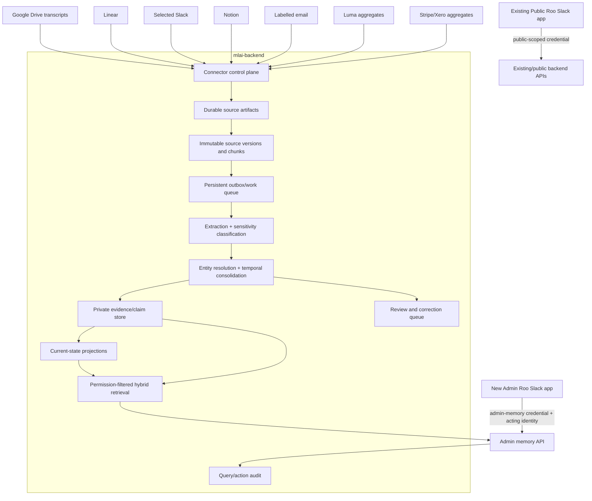

# MLAI Roo Public/Admin Organisational Brain

## Step-by-step implementation plan

**Status:** Implementation complete locally through PR28 credential-bound
signed-request verification; production activation and learned-selector
evaluation remain evidence-gated

**Prepared:** 20 July 2026

**Primary repositories:** `MLAI-AUS-Inc/mlai-backend`, `MLAI-AUS-Inc/roo`

**Companion inputs:** `MLAI_ORGANISATIONAL_BRAIN_SPEC.md`, `MLAI_CODEX_PR_PLAN.md`, and the supplied research conclusion

**Progress update (21 July 2026):** governance/inventory/evals, the Public/Admin
Roo deployment boundary, scoped service identity, verified actor assertions,
versioned connector-secret encryption, backend-owned organisation
identity/membership/role/capability authorization, the source-management
control plane, immutable versioned evidence, ACL snapshots, review queue,
transactional outbox dispatcher, leased worker runtime, bounded retries,
dead-letter recovery, cursor-safe sync runs, and daily scheduler services are
implemented and tested. PostgreSQL full-text search, version-pinned pgvector
embeddings, safe extension preflight, degraded text retrieval, re-embedding,
and a mandatory PostgreSQL query-plan CI lane are also implemented. Google
Drive exact-root discovery, metadata-only inventory/approval, durable artifact
and ACL versions, removal handling, change cursors, and verified webhook wake
hints are implemented. Approved Drive backfills now add bounded Google Docs,
DOCX, text/Markdown, PDF text-layer, VTT, and SRT parsing; meeting lineage and
duplicate suppression; speaker/time-aware evidence chunks; oldest-first resume;
and reconciliation reports. Other providers remain fail-closed until each
reviewed ingestion adapter lands in its later implementation PR.

**Progress update (22 July 2026):** extraction, temporal consolidation, hybrid
retrieval, cited answers, traces, feedback, and the separate Admin Roo surface
are implemented through PR13. PR14 adds real Linear and selected-Slack memory
adapters over durable existing artifacts, exact-scope backfill and incremental
cursors, immutable content/ACL versions, deletion and access reconciliation,
Slack DM exclusion and quiet-period chunking, verified replay-safe provider
wake events, artifact-save wake signals, and daily fallback reconciliation.
PR15 replaces Notion's metadata-only adapter and run-scoped page-bundle
dependency with explicit page/data-source roots, recursive durable page/block
artifacts, resumable full scans, block-level citation locators, soft-delete and
access reconciliation, signed replay-safe webhook wakes, and daily fallback
reconciliation. PR16 replaces Gmail's metadata-only registration with approved
mailbox/user-label discovery, exact message-to-label membership, restricted
thread and extracted-attachment versions, minimized incremental hydration,
history-cursor full-scan recovery, deletion/label/access revocation, optional
OIDC-authenticated replay-safe Pub/Sub wakes, exact-label watch renewal, and
daily full reconciliation. PR17 replaces the remaining Stripe, Xero, and Luma
metadata-only registrations with exact aggregate/event scopes, a durable
sanitized calculation inventory, deterministic MRR and monthly metrics,
current-period volatility and staleness markers, removal/access reconciliation,
debounced artifact wakes, verified replay-safe metadata-only Xero webhook
receipts, and hard exclusions for raw finance data and Luma attendee PII.

**Progress update (23 July 2026):** PR18 extends the durable scheduler with
provider-specific due intervals, one idempotent daily reconciliation/report
window per organisation, outage catch-up, same-window sync reuse, explicit
no-op outcomes, Google Drive and Gmail watch renewal, content-free connection
health snapshots, freshness SLOs, operator alerts, and organisation-scoped
health output. Atomic daily AUD reservations now gate embedding, extraction,
and consolidation work without ever blocking source deletion or permission
reconciliation.

**Progress update (23 July 2026, PR19):** organisation-scoped
contradiction/correction/entity/sensitivity/stale review queues, permission-
filtered evidence detail, governed idempotent review resolution, and confirmed
idempotent source-scope reprocessing are implemented. Fully healthy daily reports now generate deterministic
thread/day/week/project summaries plus daily open-loop and weekly committee
digests with explicit claim/evidence/source-version/chunk lineage. Unhealthy
reports create content-free blocked digests, while source access revocation or
tombstoning immediately invalidates linked summaries and blocks affected
digests.

**Progress update (23 July 2026, PR20):** optional deliberate publication is
implemented behind a disabled-by-default feature flag. Private claim/summary
candidates now move through deterministic sensitivity checks, explicit
redaction confirmation, a high-priority publication queue, frozen source
fingerprints, and independent capability-gated human approval. Approved
payloads are copied into revisioned `PublicKnowledgeItem` snapshots with no
private lineage fields and dedicated PostgreSQL full-text/vector indexes. The
rate-limited public endpoint imports no private retrieval and can see only
active public rows. New private source versions, access revocation,
tombstoning, and linked-claim lifecycle changes automatically retire affected
public snapshots.

**Progress update (23 July 2026, PR21):** the optional Admin Roo controlled
action gateway is implemented behind disabled-by-default global and Linear
execution kill switches. It supports local Gmail/Slack/Notion drafts plus
narrowly allowlisted Linear issue create/update proposals; immutable request
hashes; organisation- and scope-bound connectors; authorised evidence
revalidation; a deterministic risk matrix; live precondition refresh at
proposal, approval, and execution; independent `approve_actions` review;
idempotent execution; stale-approval invalidation; content-minimised
append-only audit; visible non-retrying failures; state-safe reversals; and
durable result-ingestion requests. Public Roo is rejected at the authentication
boundary, and finance/payment/contract/role/governance writes remain
unsupported. The separate Roo repository now adds an explicitly feature-gated
`admin-actions` skill, content-minimised proposal cards, reasoned rejection
modals, backend-authoritative approve-and-execute callbacks, exact actor
assertions, replay-safe idempotency, and Public Roo isolation.

**Progress update (23 July 2026, PR22):** an offline-only learned-selector
boundary is implemented behind separate disabled-by-default export and shadow
flags. Query traces are re-authorised against current identity, membership,
capability, classification, source lifecycle, version tombstone, and ACL state;
one invalid candidate excludes the full trace. Exports contain only a fixed
versioned numeric feature allowlist, dedicated-secret HMAC pseudonyms, and
explicit non-conflicting relevance labels; no raw query, answer, actor, Slack,
source, citation, claim, chunk, or evidence content is emitted. A strict local
JSON `LearnedMemorySelectorV2` linear scorer, 3,000-labelled-trace minimum,
content-minimised run/result metrics, idempotent shadow comparison, admin,
teardown, commands, migration, tests, and runbook are complete. Retrieval and
answer code do not import the shadow module, promotion is only an offline
signal, and reinforcement learning is absent. Actual model evaluation remains
blocked until representative trace and label thresholds are met.

**Progress update (23 July 2026, PR23):** the first rollout phase now has a
single read-only, machine-readable pilot-readiness preflight. It validates a
strict expiring human approval manifest; exact one-to-three Slack actors and
approved contexts; deployment/organisation/governance provider alignment;
reviewed source policies, selected scopes, approved previews and dry runs;
dedicated read-only Admin Roo service identity; optional-feature kill
switches; actor assertion bounds; production PostgreSQL/vector and Django
security checks; clean queues; fresh alert-free daily reconciliation; current
evidence; and all offline seed suites. Preflight leaves the query API off; live
mode verifies it only after an independently reviewed deployment. Reports are
content-free and the command performs no writes. The checked-in approval
template and provider policies remain draft, so no production authority has
been inferred or granted.

**Progress update (23 July 2026, PR24):** the read-only pilot now has an
immutable, content-free human audit ledger and a separate aggregate exit-gate
evaluator. Strict atomic audit batches require an independent active reviewer,
an effective review capability, exact query-mode scoring, derived citation
counts, bounded size, idempotency, and a frozen rubric. A distinct approved
exit policy binds the original pilot-approval hash, a minimum seven-day
window, sample floors, quality thresholds, failure/latency/token ceilings, and
review/security/operations sign-off. Reports measure complete answer-decision
audit coverage, high-risk citation precision, current-state/temporal/
abstention accuracy, faithfulness, zero permission/Public-Admin leaks, exact
actor/context scope, query reliability, token and daily cost ceilings,
freshness, daily health coverage, and backfill/deletion/revocation failures.
Reports expose only hashes and aggregates. Neither command activates Admin
Roo, changes a source, expands access, or modifies Public Roo.

**Progress update (23 July 2026, PR25):** pilot approval is now enforced at
the live API boundary through an immutable staged/active/suspended deployment
record. Exact approved Slack actors and contexts are stored only as
organisation-scoped HMACs under a dedicated versioned secret. Staging repeats
the full preflight without enabling access; activation requires the query flag,
live readiness, an unexpired exact approval binding, and a second independent
operator. Query, review, and derived-artifact endpoints deny every Admin Roo
request until the signed actor and context match an active binding, while all
existing membership, capability, service-principal, classification, source,
and ACL checks remain in force. Dry-run-first stage, activate, suspend, and
content-free report commands, read-only admin, teardown coverage, migration,
runbook, and regression tests are complete. Configuration loss, approval
expiry, key rotation, context mismatch, suspension, and Public Roo all fail
closed. No command changes a feature flag or source configuration.

**Progress update (27 July 2026, PR26):** the first operational staging audit
now has explicit release controls across both repositories. A content-free
backend deployment gate permits the global query flag only when the configured
organisation has a current staged/active binding under the deployed HMAC key
and every optional feature remains off; normal flag-off releases are
unchanged. Pilot approval and Admin Roo startup now reject public Slack
channels, while an exact-config validator binds Roo's private channel and DM
allowlists to the restricted approval without emitting identifiers. Admin Roo
uses an isolated Compose project and a manual-only protected staging workflow,
so Public Roo deploy/orphan cleanup cannot remove it. The workflow requires
pre-provisioned host secrets, approval, Slack app credentials, and scoped
backend credential; it performs no approval, credential, backend activation,
or Public Roo mutation automatically.

**Progress update (27 July 2026, PR27):** active pilot startup now has a
non-mutating, content-free access-matrix gate. It validates the exact
restricted approval, active deployment hash, review window, HMAC key version,
pseudonymised actor/context sets, and provider/source counts before exercising
the same runtime allowlist permission used by private APIs. Every approved
actor/private-channel combination and approved actor-bound DM must pass;
synthetic unapproved actors, unapproved private/public channels, and Public Roo
must fail. Reports expose only aggregate expected/pass counts and blocker
codes. No memory content, Slack call, query, source mutation, credential
change, feature enablement, deployment, or Public Roo change occurs.

**Progress update (27 July 2026, PR28):** the real Admin Roo
service-principal and actor-assertion path now has a content-free live smoke
gate. A dedicated backend endpoint requires the complete private
authentication, verified Slack identity, membership/capability, active
actor/context allowlist, and live query-flag boundary, but returns no
organisation, actor, channel, source, capability, or memory data. Roo signs
fresh requests for every approved private-channel combination and actor-bound
DM, expects 401/403 for representative unknown actors and unapproved
private/public contexts, and independently proves the Public Roo client cannot
construct private-memory headers. The protected manual staging workflow runs
this aggregate-only gate after isolated Admin Roo readiness. It sends no
memory query and performs no source, memory, or business-data write, Slack
call, credential change, activation, feature enablement, or Public Roo
deployment. Normal credential-use timestamps, replay receipts, and security
audit events are still recorded.

---

## 1. Outcome and binding decisions

This plan delivers two Roo surfaces without forking the product into two unrelated codebases:

1. **Public Roo** remains the existing community-facing Slack app and installation.
2. **Admin Roo** is a new, separately installed Slack app and separately deployed Roo service for authorised MLAI administrators and committee members.
3. Both deployments may use the same `roo` codebase, selected with a fail-closed deployment mode such as `ROO_SURFACE=public|admin`.
4. Only Admin Roo receives a backend credential capable of calling private organisational-memory endpoints.
5. `mlai-backend` owns the canonical evidence, permissions, memory, retrieval, audit, background work, and source connections.
6. The first Admin Roo release is **read-only, source-cited, and approval-free**. It answers questions but cannot send email, change Linear, publish Notion pages, spend money, or make commitments.
7. “Updates itself daily” means incremental source synchronisation, reprocessing of changed evidence, temporal consolidation, current-state refresh, and health reporting. It does **not** mean retraining a foundation model on company data.
8. The first useful vertical slice is the historical Google Drive meeting-transcript corpus, followed by Linear and selected Slack channels. Notion, labelled email, Luma, Stripe, and Xero then plug into the same connector contract.
9. Private source content is treated as untrusted input. It can supply evidence but can never grant permissions, change system instructions, or trigger tools.
10. The public and admin security boundary is enforced in credentials, endpoints, database queries, and deployment configuration—not by an LLM prompt.

### 1.1 Three concepts that must not be conflated

| Concept | Meaning in this plan | Data access |
|---|---|---|
| Public Roo | The existing MLAI community Slack bot | Existing behaviour and already-authorised workflows; no private organisational-memory credential |
| Admin Roo | A new private Slack app for authorised MLAI operators | Permission-filtered organisational memory |
| Published public knowledge | A possible later website/public-Q&A corpus | Only human-approved `PublicKnowledgeItem` records |

Keeping Public Roo does not require building the published-public-knowledge product first. That later capability is intentionally outside the Admin Brain MVP critical path.

---

## 2. Definition of done

The Admin Brain MVP is complete when an authorised MLAI administrator can ask Admin Roo questions such as:

- “What did we decide about the member directory?”
- “Who owns sponsor outreach now?”
- “What changed in this project last week?”
- “What commitments from the last three meetings are still open?”
- “What evidence supports that answer?”
- “Who owned this on 2 July?”

and receive an answer that:

- is restricted to the caller’s organisation, role, capabilities, source permissions, and Slack context;
- cites the exact source document/thread/record and date;
- distinguishes current state from historical state;
- discloses stale or conflicting evidence;
- abstains when evidence is insufficient;
- can be traced through a query ID and retrieval log;
- reflects changed connected sources within the agreed freshness target;
- cannot be reproduced through Public Roo or a public channel.

The source-management requirement is complete when an authorised operator can connect an additional supported account, choose its allowed folders/channels/projects/labels, preview and approve a backfill, monitor its freshness, pause it, reprocess it, and delete it without a code deployment.

---

## 3. Repository baseline and implications

The project is not starting from zero. The implementation should reuse these existing foundations.

| Existing capability | Current code anchor | Reuse | Gap to close |
|---|---|---|---|
| Django, DRF, PostgreSQL, service API keys | `mlai/settings.py`, `core/permissions.py` | Backend/API foundation | Existing Roo keys are interchangeable and do not represent a scoped service principal |
| Organisation | `organizations/models.py` | Tenant root | Model has no durable membership, capability, or external-identity layer |
| Slack/Gmail/Linear artifacts | `startup_updates/models.py` | Initial source adapters | Need immutable versions, permission reconciliation, tombstones, and memory enqueue hooks |
| Connector OAuth for Notion, Drive, Slack, Linear, Stripe, Xero, Luma | `integrations/models.py`, `integrations/services/external_connectors.py` | Connection control plane | Several providers are connected but do not yet create durable document artifacts |
| Notion startup-update scan | `startup_updates/api_views.py` | Parsing and API-call patterns | Page bundles currently live in run-scoped JSON and traversal is bounded rather than a durable corpus |
| Gmail history cursor | `startup_updates/models.py`, `integrations/services/gmail.py` | Incremental mailbox sync | Scope it to approved accounts/labels and feed changes into memory |
| Stripe/Xero financial records and metrics | `integrations/services/finance.py` | Approved aggregate facts | General memory must not expose raw transactions or unrestricted finance data |
| Luma event selection and metrics | `startup_updates/models.py`, `integrations/services/luma_sync.py` | Event facts | Attendee PII needs a separate capability and should not enter general memory |
| Scheduler polling every minute | `docker-compose.yml`, `core/management/commands/run_scheduled_discovery.py` | Scheduling convention | Memory needs its own persistent queue, worker, and scheduler service |
| Roo FastAPI app, skill router and backend client | sibling repo `roo/roo-standalone/roo/` | Both Slack surfaces | Add deployment mode, Admin Brain skill, scoped headers, and separate secrets |
| Roo thread context | sibling repo `roo/roo-standalone/roo/agent.py` | Short conversational continuity | It is process-local, lasts about 30 minutes, and is not organisational memory |

### 3.1 Repository-specific blockers to resolve early

1. Production Compose currently uses stock `postgres:15`. Enabling `CREATE EXTENSION vector` will fail unless pgvector is installed. Use a pgvector-capable image in controlled environments or verify the managed production database extension before applying the migration.
2. Local development and many tests use SQLite. Vector fields and PostgreSQL full-text behaviour require a PostgreSQL integration-test lane; a text-only SQLite fallback remains useful for unit tests.
3. `HasRooApiKey` accepts several interchangeable keys. Private-memory endpoints must use a new scoped service-principal authenticator and must never inherit that fallback behaviour.
4. Roo currently checks only the age of inbound Slack requests in `roo/main.py`; the Admin deployment must verify the HMAC signature over the raw body for events, commands, and interactive actions before it is exposed.
5. Roo’s current `/api/mention` endpoint is unauthenticated and accepts a caller-supplied Slack user ID. Disable it on internet-facing deployments or require a separate authenticated, signed internal request; it must never become a path for forging an Admin Roo actor.
6. Existing privileged Roo skills must be inventoried. Preserve their current behaviour and server-side permission checks unless separately changed, but prove that Public Roo has no path to the new private organisational-memory or future brain-action APIs even though the shared codebase contains those implementations.
7. The existing encrypted connector field derives from the Django secret and can return undecipherable stored text after a decryption failure. Before adding more sensitive admin connections, make credential decryption fail closed, add key versions and rotation, and document a path to KMS/envelope encryption.
8. Roo’s deploy workflow has no test gate and the backend deploy workflow runs only a targeted subset. Both repositories need mandatory security, connector, data-access, and PostgreSQL integration tests before Admin Roo can deploy.

---

## 4. Target architecture



### 4.1 Repository ownership

`mlai-backend` owns:

- organisation identity, membership, capabilities, service principals, and source ACLs;
- connector configuration, sync state, source policies, artifacts, and deletion;
- evidence versions, chunks, embeddings, entities, claims, current state, summaries, and reviews;
- retrieval, context packing, answers, citations, feedback, evaluation, and audit;
- the memory worker and daily/incremental scheduler.

`roo` owns:

- Slack signature verification and event handling;
- Public/Admin deployment mode and skill allowlists;
- forwarding team, channel, actor, thread, request, and surface identity;
- invoking the correct backend endpoint;
- rendering answers, dates, warnings, citations, and feedback buttons;
- graceful failure without a private-data fallback.

Roo does not own canonical memory, role decisions, embeddings, source authority, or public/private filtering.

---

## 5. Security and access-control design

This section is a prerequisite, not a later hardening pass.

### 5.1 Two Slack apps and two deployments

Create a second Slack app named **Roo Admin**. Keep the current app, name, installation, and request URLs for Public Roo.

Admin Roo must have:

- its own Slack app ID, client ID/secret, bot token, signing secret, and request URLs;
- its own deployment hostname/service and secrets;
- an installation limited to the MLAI workspace;
- an explicit DM/private-channel allowlist for the pilot;
- only the Slack scopes needed for mentions, replies, commands, and interactions;
- no source-ingestion scopes unless the reviewed Slack acquisition design intentionally uses that same app;
- an admin-memory backend credential not present in Public Roo’s environment.

Use one shared Roo codebase with configuration such as:

```text
ROO_SURFACE=public | admin
ROO_ENABLED_SKILLS=<explicit allowlist>
ORG_BRAIN_ENABLED=false | true
ORG_BRAIN_BACKEND_TIMEOUT_SECONDS=20
ORG_BRAIN_MAX_CONTEXT_TOKENS=6000
ORG_BRAIN_ALLOWED_CHANNEL_IDS=...
```

The application must refuse to boot when `ROO_SURFACE=public` and an admin-memory credential is present, or when `ROO_SURFACE=admin` lacks its required signing secret and scoped credential.

### 5.2 Scoped backend service principals

Add a service-principal model or equivalent hashed-key registry:

```text
BrainServicePrincipal
  id
  organization
  name
  surface: public_roo | admin_roo | worker | operator
  key_digest
  scopes[]
  active
  expires_at
  last_used_at
  created_at
  rotated_at
```

Initial scopes:

```text
public_roo: existing approved public/community scopes only
admin_roo: org_memory.answer, org_memory.search, org_memory.feedback
memory_worker: source.read, memory.process, memory.reconcile
operator: source.manage, memory.review
```

Private-memory endpoints must reject legacy `INTERNAL_API_KEY`, `MLAI_API_KEY`, and Public Roo’s key even when a valid Slack user ID is supplied.

Every Admin Roo request includes:

```text
X-Service-Key
X-Roo-Surface: admin
X-Slack-Team-ID
X-Acting-Slack-User-ID
X-Slack-Channel-ID
X-Slack-Thread-TS
X-Request-ID
```

The raw actor headers are not independently trusted. After verifying the Slack request, Admin Roo also sends a short-lived, replay-protected actor assertion (signed by the Admin Roo service principal) binding surface, Slack team, actor, channel, event/request ID, issued-at, and expiry. The backend validates that assertion and rejects raw caller-supplied identity headers without it. The backend then resolves organisation and capabilities. Roo never sends or selects a role.

### 5.3 Organisation identities, roles, and capabilities

Do not use the points-specific `PointsAdmin` table as the long-term brain authorisation model. Use it only as a reviewed migration seed.

Add:

```text
OrganizationIdentity
  organization
  user
  provider
  external_tenant_id   # Slack team/workspace ID, Google tenant/account, etc.
  external_user_id
  email_at_link_time
  verified_at
  active

OrganizationMembership
  organization
  user
  active
  joined_at
  ended_at

OrganizationRoleAssignment
  membership
  role
  valid_from
  valid_until

OrganizationCapabilityGrant
  membership or role
  capability
  effect: allow | deny
  valid_from
  valid_until
```

Multiple role assignments are preferable to one role string because committee, finance, executive, people-ops, reviewer, and project-lead duties can overlap.

Initial capabilities:

```text
view_general_memory
view_email_memory
view_finance_memory
view_people_sensitive_memory
view_executive_memory
review_claims
manage_sources
publish_knowledge
approve_actions
```

Inactive, unmapped, ambiguous, or cross-workspace identities fail closed.

### 5.4 Source access is classification plus ACL

A visibility label such as `committee` is not sufficient for a private Slack channel or restricted Drive file. Store both:

- a classification ceiling (`internal`, `committee`, `executive`, `finance`, `people_sensitive`, `no_agent`); and
- a versioned source ACL snapshot containing provider principal IDs, groups, link-sharing state, and the time captured.

At query time:

1. resolve the acting user and organisation;
2. resolve role/capabilities;
3. resolve current provider principal mappings;
4. exclude `no_agent`, tombstoned, revoked, and inaccessible sources in SQL;
5. only then generate/rank candidates.

Do not send inaccessible snippets, embeddings, IDs, or existence hints to an LLM, reranker, log, or error response.

### 5.5 Channel-context rule

Personal authorisation does not make a Slack channel safe. For the MVP:

- Admin Roo answers private memory only in an allowlisted admin channel or DM;
- a request in any public/community channel is rejected or redirected to a private context before retrieval;
- Public Roo can never proxy a private answer;
- channel classification is verified server-side using the signed event context and configured channel registry.

### 5.6 Untrusted-content and privacy controls

- Wrap all retrieved source text as data, never instructions.
- Strip or neutralise tool-call/system-prompt patterns before model context construction while preserving the original evidence separately.
- Run secret/DLP scanning before embedding or sending source text to a model.
- Block credentials, identity documents, medical/HR/legal data, auth messages, and configured `no_agent` locations.
- Use model-provider settings/contracts that prohibit training on MLAI data and meet the approved retention/region policy.
- Encrypt credentials at rest; do not put OAuth tokens in source records, work payloads, query logs, or prompts.
- Make decryption failures fatal for connector use; never return ciphertext or legacy plaintext as if it were a valid token. Store a key version, provide a rotation command with dry-run/rollback reporting, and separate credential-encryption keys from Django session/signing secrets.
- Rate-limit answer and review endpoints and retain audit logs for an approved period.
- Define hard-delete versus tombstone behaviour before ingestion begins.

---

## 6. Canonical memory and work-queue model

The supplied specification’s source/chunk/claim split is correct, with four changes needed for production correctness: immutable source versions, explicit ACLs, a canonical review item, and append-only state events.

### 6.1 Connection and source control models

Reuse `ExternalServiceConnection` for encrypted provider tokens. Add:

```text
MemorySourceScope
  connection
  scope_type       # folder, shared_drive, channel, project, label, account, event
  external_id
  name
  selected
  default_classification
  policy
  last_previewed_at

MemorySourcePolicy
  organization/provider/source_type
  optional scope/kind/predicate match
  classification
  authority_score
  volatility
  stale_after
  allowed_memory_kinds
  auto_activation_rules
  review_rules
  retention_policy
```

Policy matching must be able to express “Linear is authoritative for task status” without treating it as authoritative for all strategic context.

### 6.2 Evidence models

```text
MemorySource
  stable provider object identity
  organization, provider, external_account_id, source_type, external_id
  current_version
  canonical_url
  tombstoned_at

MemorySourceVersion
  source
  version_key          # provider revision/etag/modified time + content hash
  source timestamps
  content hash
  bounded excerpt
  metadata
  ACL snapshot
  classification
  captured_at
  retired_at

MemoryChunk
  source_version
  ordinal and source-native locator
  text
  speaker/timestamp/section metadata
  content hash
  classification
  embedding/model/version
  active_for_retrieval
```

Edits create a new version. Old chunks remain available only to authorised historical/audit queries and are excluded from current retrieval.

### 6.3 Interpretation models

```text
MemoryEntity
MemoryEntityAlias
MemoryClaim
MemoryEvidence
MemoryClaimLink
MemoryClaimStateEvent
MemoryCurrentState
MemorySummary                 # later phase
```

Each claim stores:

- subject, predicate, object/value, kind, and atomic statement;
- observed time, valid-from/to, recorded time, last-confirmed time, and stale-after;
- authority, confidence, importance, volatility, classification, and status;
- extractor/parser/schema/prompt/model versions;
- one or more exact evidence locators.

Staleness should be computed from dates/policy and exposed as a flag, not used as the only lifecycle status. This permits an active-but-stale latest-known claim to be returned with a warning.

Unresolved contradictory claims remain queryable through an explicit conflict lane even when neither is safe to assert as the sole current state.

### 6.4 Review, correction, and publication models

```text
MemoryReviewItem
  type: claim_activation | contradiction | correction | sensitivity | stale | entity_merge | publication
  target content type/id
  severity
  reason
  status
  assigned_to
  due_at
  resolution
  created_at/resolved_at

MemoryFeedback
MemoryQueryLog
```

Later public publishing adds `MemoryPublication` and the physically separate `PublicKnowledgeItem`; it never flips a private claim’s visibility in place.

### 6.5 Transactional outbox and work queue

Add:

```text
MemoryOutboxEvent
MemoryWorkItem
MemoryWorkerLease
MemoryDeadLetter
```

Connector artifact upsert and outbox creation occur in the same database transaction. A dispatcher converts outbox events into idempotent work items after commit.

Work idempotency key:

```text
organization
+ provider/external account/source ID
+ source version
+ task type
+ parser/extractor/embedding version
```

Workers claim work with `select_for_update(skip_locked=True)`, a lease expiry, heartbeat, exponential backoff, bounded attempts, provider and organisation concurrency limits, and a dead-letter record. A killed worker’s expired lease must be recoverable.

---

## 7. Standard connector contract and source-management experience

### 7.1 Adapter contract

Every connector implements the same conceptual operations:

```python
class MemoryConnector(Protocol):
    def discover_scopes(self, connection, cursor=None) -> ScopePage: ...
    def preview(self, connection, selected_scopes, policy) -> SourcePreview: ...
    def backfill(self, connection, selected_scopes, checkpoint) -> SyncPage: ...
    def incremental_sync(self, connection, cursor) -> SyncPage: ...
    def refresh_permissions(self, connection, checkpoint) -> SyncPage: ...
    def fetch_version(self, external_id) -> SourceVersionPayload: ...
    def tombstone_missing(self, sync_run) -> TombstoneResult: ...
    def health(self, connection) -> ConnectorHealth: ...
```

The result contract includes canonical IDs/URLs, version keys, source times, raw-to-normalised metadata, ACLs, removals, next cursor/checkpoint, rate-limit information, and retryability.

Adding another account/workspace for a supported provider must be configuration-only. Adding a new provider requires an adapter, fixtures, policy defaults, deletion implementation, and conformance tests.

### 7.2 Operator workflow for adding a source

Implement this flow first in Django admin/API; a richer surface may later live in `mlai-admin`.

1. Choose provider and organisation.
2. Complete organisation-owned OAuth or enter the approved service credential.
3. Verify account/workspace identity and requested scopes.
4. Discover and select folders, Shared Drives, channels, projects, labels, events, or finance aggregates.
5. Preview file/record counts, date range, file types, owners, permission classes, unsupported items, estimated embedding/extraction cost, and expected review volume.
6. Set classification, authority, staleness, allowed memory kinds, historical cutoff, and retention policy.
7. Map provider users/groups to MLAI identities; surface unresolved identities.
8. Run a bounded dry-run that creates sample artifacts/chunks/candidate claims but no active memory.
9. Review samples and approve a resumable initial backfill.
10. Enable webhook/change-cursor sync plus daily reconciliation.
11. Monitor cursor, last success, source lag, changed items, failures, dead letters, model cost, and review backlog.
12. Support pause, resume, manual sync, scoped reprocess, permission refresh, folder/channel removal, hard delete/tombstone, and full disconnect.

### 7.3 Required management APIs

```text
GET  /api/v1/org-memory/connectors
POST /api/v1/org-memory/connectors/{provider}/connect
GET  /api/v1/org-memory/connections/{id}/scopes
POST /api/v1/org-memory/connections/{id}/preview
POST /api/v1/org-memory/connections/{id}/backfill
POST /api/v1/org-memory/connections/{id}/sync
POST /api/v1/org-memory/connections/{id}/pause
POST /api/v1/org-memory/connections/{id}/resume
POST /api/v1/org-memory/connections/{id}/reprocess
DELETE /api/v1/org-memory/connections/{id}
GET  /api/v1/org-memory/connections/{id}/health
```

All writes require `manage_sources`, are audited, and are organisation-scoped.

---

## 8. Google Drive transcript vertical slice

This is the first end-to-end source because it directly addresses the historical meeting corpus and exercises the hard parts: large backfill, file parsing, temporal evidence, speaker resolution, duplicates, review, and daily updates.

### 8.1 Inventory before ingestion

Add a read-only inventory command/API that accepts one or more approved folder or Shared Drive IDs and reports:

- files by MIME type, owner, year/month, size, and modified time;
- likely transcript/meeting-note files based on name, folder, MIME type, and text sample;
- Google-native versus uploaded files;
- shortcuts and duplicate targets;
- inaccessible/download-disabled files;
- estimated extracted characters/tokens, embedding cost, extraction cost, processing time band, and review items;
- unsupported audio/video/Google Vids items;
- proposed historical cutoff and batches.

No content becomes active memory during inventory.

### 8.2 Durable Drive artifacts

Create `ExternalDocumentArtifact` or `DriveDocumentArtifact` with:

```text
organization and connection
drive/shared-drive ID
file ID and shortcut target ID
parent IDs and selected root scope
name, MIME type, size
webViewLink
createdTime, modifiedTime, version/head revision/etag where available
checksum/content hash
owners and bounded permission snapshot
trashed/removed/access-lost state
extraction status/error
last seen/synced timestamps
```

Use Drive `changes.getStartPageToken` and `changes.list` for incremental reconciliation. Push notifications may wake the sync early, but notifications are only hints; the changes feed and daily reconciliation remain authoritative.

### 8.3 Supported content

MVP parsers:

- Google Docs exported to a deterministic text-capable format;
- DOCX;
- text and Markdown;
- PDF with text layer;
- VTT and SRT transcripts.

Use the repository’s existing `python-docx`, `pypdf`, and document parsing patterns. Preserve headings, paragraphs, speaker labels, timestamps, page/section positions, and parser warnings.

For scanned PDFs, audio, video, and recordings without an existing transcript:

- create an unsupported/needs-transcription artifact and visible work item;
- do not silently skip it;
- treat OCR/transcription as a separately costed follow-up phase.

### 8.4 Meeting normalisation and deduplication

Create a stable meeting identity using the strongest available combination of calendar/event ID, recording/transcript relationship, source metadata, meeting date/timezone, title, and participants.

Link rather than double-count:

```text
recording
↔ transcript
↔ meeting notes
↔ Slack recap
↔ Linear tasks created from the meeting
```

Near-duplicate copies must not be treated as independent corroborating sources. Record provenance lineage (`copied_from`, `derived_from`, `same_meeting_as`) and cap confidence accordingly.

### 8.5 Conversation-aware chunks

- Prefer speaker turns and timestamp ranges over arbitrary character windows.
- Preserve the meeting title/date/timezone and attendee context on each chunk.
- Keep explicit decisions, reversals, owners, and deadlines together where possible.
- Bound chunk size by the selected embedding model and use small overlap only when necessary.
- Store exact section/page/speaker/timestamp locators for citations.
- Never merge content with different source ACLs.

### 8.6 Two-stage extraction

Stage A creates a source-grounded meeting digest:

```text
purpose
attendees/speaker mapping
topics
decisions
commitments and owners
deadlines
project status changes
risks/blockers
open questions
explicit reversals or uncertainty
```

Stage B converts only durable items into candidate atomic claims. Raw transcript statements are testimony or proposals unless decision cues, participant authority, and/or a system-of-record source justify stronger status.

Consequential decisions, external commitments, person-sensitive claims, ambiguous speakers, and conflicts enter review.

### 8.7 Backfill execution

1. Save an immutable inventory manifest.
2. Select a small representative pilot batch across years and formats.
3. Parse/chunk without LLM extraction; review parser quality.
4. Run extraction in dry-run mode and tune the schema/policy on the seed evaluation set.
5. Approve the prompt/model/schema version.
6. Process batches oldest-to-newest so temporal supersession is deterministic.
7. Checkpoint after every page/file batch.
8. Apply per-day token/cost ceilings and pause safely when reached.
9. Retry transient failures; dead-letter unsupported or consistently failing files.
10. Produce a reconciliation report: inventoried, processed, unchanged, duplicate, unsupported, failed, claims created, reviews required, and cost.
11. Run a second inventory and prove that unchanged files create no new extraction/embedding work.

### 8.8 Transcript acceptance tests

- An interrupted 10,000-file backfill resumes without duplicate artifacts, chunks, claims, or evidence.
- A corrected transcript creates a new source version; old chunks disappear from current retrieval.
- A deleted/unshared file and all exclusively derived current memory stop appearing within the removal SLO.
- A repeated decision in transcript and copied meeting notes is not counted as two independent sources.
- Every transcript-derived claim cites meeting, date, exact speaker/section/timestamp where present, and evidence span.
- Ambiguous speaker identities remain unresolved and enter review.
- Brainstorming is not labelled as a committee decision.

---

## 9. Provider-by-provider ingestion plan

### 9.1 Linear

Reuse `LinearProjectArtifact`, `LinearIssueArtifact`, and `LinearProjectUpdateArtifact`.

- Add artifact version hashes, removals, permission/team scope, and enqueue-on-change.
- Register verified webhooks for issue, project, project-update, document, and OAuth-revocation changes; return quickly and enqueue work.
- Retain a daily cursor/poll reconciliation because webhooks can be delayed, fail, or be disabled.
- Treat Linear as authoritative for issue status, assignee, due date, and project operational state—not automatically for policy or strategic rationale.
- Supersede prior current-state claims deterministically when the structured record changes.
- Link meeting-extracted commitments to created/existing Linear issues.

### 9.2 Selected Slack

Before indexing, complete an explicit governance record stating whether the installation is internal, which API/export supplies persistent evidence, retention/deletion rules, and the terms-review owner/date.

- Start with allowlisted shared committee/project channels; exclude DMs.
- Default private channels to their real source ACL plus committee/internal classification.
- Ingest threads as units and preserve message-level timestamps/links.
- Debounce active threads until quiet for five minutes.
- Handle edits, deletions, channel archive/deletion, membership/permission changes, and connection revocation.
- Skip joins, reminders, bot noise, and channels marked `no_agent`.
- Treat informal discussion as low authority unless corroborated or reviewed.
- If Slack acquisition must use the Real-time Search API, use it only at user query time and do not store/copy its returned data into the permanent memory index.

The Slack app used for answering and the Slack connection used for source acquisition are separate security concerns and may use separate installations/scopes.

### 9.3 Notion

Replace the current run-scoped page JSON cache with durable document artifacts.

- Allowlist page roots/data sources rather than indexing the entire accessible workspace by default.
- Recursively traverse child blocks/pages with pagination and bounded checkpoints.
- Preserve headings, block IDs, source times, page URL, parent tree, and permission/access snapshot.
- Register and HMAC-verify Notion webhooks; an event enqueues a fresh API read rather than trusting the event body as content.
- Reconcile selected roots daily to catch missed events and access changes.
- Give approved policy/procedure pages high predicate-specific authority.
- Treat ordinary notes and meeting pages as candidate evidence requiring the same decision rules as transcripts.

### 9.4 Gmail / email

Start only with approved shared/role accounts and labels such as sponsor, partner, event, and selected finance correspondence.

- Reuse `GmailSyncCursor`, messages, hydrated threads, participants, dates, and attachments.
- Use `history.list` for partial sync and full resync only when the history cursor is invalid/expired.
- If Gmail push is enabled, use it as a wake-up signal; renew each mailbox watch daily and retain periodic reconciliation for missed notifications.
- Do not ingest personal mailboxes or unlabelled mail.
- Minimise quoted evidence and default email to restricted classification.
- External promises, commercial terms, contact details, and relationship changes require suitable capabilities/review.
- Attachments follow the same document parser, ACL, version, and deletion contracts.

The adapter boundary should permit Outlook or another provider later without changing the claim/retrieval layer.

### 9.5 Stripe and Xero

Use structured, approved aggregates by default.

- Reuse `ExternalFinancialRecord`, `StartupMetricObservation`, current Stripe sync/webhook, and Xero invoice/payment/report sync.
- Add verified Xero webhooks where supported and retain a daily reconciliation.
- Map monthly revenue, cash collected, receivables/payables summaries, sponsor payment status, and event P&L into finance-classified structured claims.
- Do not embed raw bank feeds, line-item descriptions, payer details, or full invoices into general memory.
- Require `view_finance_memory` before SQL candidate generation.
- Latest period/source-of-record values supersede the current projection; old snapshots remain historical evidence.
- Finance write actions remain out of scope until the separate approval-action phase.

### 9.6 Luma

Reuse `LumaEventSelection` and event metric publication.

- Ingest event identity, dates, venue/public URL, registration counts, attendance counts, and approved aggregate conversion metrics.
- Poll incrementally/daily using provider timestamps and event selection because the current connector is polling-oriented.
- Treat upcoming-event details as volatile through event end and supersede on change.
- Keep attendee names, emails, ticket answers, and exports outside general memory; require a narrow capability and explicit use case.
- Tombstone cancelled/removed events and retain permitted historical event facts.

### 9.7 Public website and other sources

Later adapters may ingest approved website pages, event pages, GitHub repositories, Google Calendar, or other systems. Each must satisfy the connector conformance suite: stable identity, versioning, ACL/classification, cursors, deletion, health, policy, fixtures, and idempotency.

---

## 10. Daily and incremental self-update pipeline

The robust pattern is event-driven where available, with a daily full reconciliation safety net.

### 10.1 Runtime services

Add two backend services:

```text
memory-worker
  python manage.py run_memory_worker

memory-scheduler
  calls python manage.py schedule_memory_work on a bounded polling interval
```

Do not run long extraction inside the web or existing one-minute scheduler process. The scheduler creates due sync runs/work; workers process persisted jobs.

### 10.2 Schedule

| Frequency | Work |
|---|---|
| Webhook/change notification | Verify, deduplicate, acknowledge quickly, enqueue provider/source refresh |
| Continuous worker | Claim and process due work; respect provider/organisation limits |
| Every 5 minutes | Debounced Slack thread scan, changed Linear records, queue/lease recovery |
| Every hour | Permission/tombstone reconciliation slices, stale/current-state refresh, dead-letter alert check |
| Daily, off-peak Australia/Sydney | Incremental sync every active connection, renew watches, reconcile deletions/ACLs, drain changes, consolidate claims, refresh current state, produce source-health report |
| Daily after successful reconciliation | Entity/project summaries and open-loop digest using only reconciled evidence |
| Weekly | Full selected-scope inventory checksum, high-importance staleness scan, policy/procedure review, quality/cost report |

### 10.3 Daily run state machine

```text
due
→ acquire per-connection advisory lock
→ refresh/validate credential
→ read incremental cursor/change token
→ fetch changed/deleted/access-revoked records
→ upsert artifacts + source versions + transactional outbox
→ commit next cursor only after the page is durable
→ dispatch work items
→ parse/chunk/classify/extract
→ resolve entities and consolidate claims
→ refresh current-state projections
→ reconcile source/claim/summary visibility
→ record metrics and publish health report
→ release lock
```

A failed page does not advance the cursor. An unchanged version creates no parse, extraction, embedding, or consolidation work.

### 10.4 Initial freshness objectives

These are launch targets to validate under real volume:

```text
verified webhook source change: visible within 10 minutes at p95
Slack debounced thread: visible within 15 minutes after thread quiet
polled document/event source: visible within 24 hours at p99
source access revocation/deletion: excluded from new answers within 15 minutes where notified, otherwise within the daily reconciliation window
dead work or expired credential: operator alerted within 60 minutes
daily source-health report: delivered by 08:00 Australia/Sydney
```

No digest may claim a successful daily update when a selected source is stale, partially processed, or blocked. It must name the affected connector without exposing restricted content.

### 10.5 Operator health report

For each active connection report:

- credential and webhook/watch status;
- last attempted/successful sync and source freshness lag;
- cursor/checkpoint and inventory scope;
- records seen/changed/deleted/access-revoked/unchanged;
- work pending/running/retried/dead;
- claims activated/reviewed/superseded/conflicted;
- token/embedding/model cost;
- review backlog and oldest item;
- explicit next operator action.

---

## 11. Extraction, consolidation, and current state

### 11.1 Deterministic parsing first

Use source-native structured fields before an LLM. Linear status, Luma dates, Stripe/Xero amounts, document headings, message dates, URLs, and participants should be normalised deterministically.

### 11.2 Strict extraction contract

The model returns schema-validated JSON only. Every candidate claim must include:

- kind, subject, predicate, object/value, and atomic statement;
- uncertainty and whether it is proposal, testimony, decision, or system-of-record fact;
- observed/effective dates when explicitly known;
- classification and sensitivity flags;
- confidence and importance;
- exact evidence locator and bounded quote;
- review reason where applicable.

Reject or quarantine output that lacks evidence, invents dates, infers protected traits, creates character judgements, or attempts instructions/tool calls.

Persist a versioned “no durable memory” result for noise so unchanged content is not repeatedly billed.

### 11.3 Entity resolution

Resolution order:

1. stable provider/external identity;
2. verified email or Slack team/user identity;
3. canonical configured key;
4. approved alias;
5. exact normalised name within a constrained entity type;
6. high-confidence suggested match;
7. human review.

Never auto-merge people by display name alone. Preserve speaker labels as unresolved entities until mapped.

### 11.4 Consolidation

For each candidate, deterministic code applies one model-proposed operation:

```text
NEW
DUPLICATE
SUPPORTS
REFINES
SUPERSEDES
CONTRADICTS
IGNORE
```

The application, not the model, enforces legal status transitions, validity intervals, authority rules, confidence caps, source-independence rules, and review creation.

### 11.5 Current-state projections

Maintain projections for high-value keys such as:

```text
project owner/status/blockers
active commitments/open tasks
latest sponsor/partner status
upcoming event facts
latest finance metric by period/key
active policy/procedure version
```

A projection may reference multiple claims or an unresolved conflict; do not assume every state key has exactly one uncontested value. Every projection points back to claims and evidence.

---

## 12. Retrieval and answer design

### 12.1 PostgreSQL-first search

Use:

- exact entity/predicate/current-state queries;
- PostgreSQL full-text search over claims and chunks;
- pgvector similarity over authorised claims/chunks;
- temporal and status filters;
- entity/claim links;
- later, hierarchical summaries for broad questions.

Do not make a separate graph database or vector database an MVP dependency.

Deployment work must include:

- pgvector-capable PostgreSQL preflight and migration rollback notes;
- pinned embedding model, dimensions, and version;
- HNSW/index choices tested with representative data and `EXPLAIN ANALYZE`;
- a full-text-only degraded mode when embeddings are unavailable;
- re-embedding by version without mixing incompatible vectors;
- a PostgreSQL CI lane.

### 12.2 Query plan and hard filters

Classify into:

```text
CURRENT_STATE
HISTORICAL_AS_OF
TIMELINE
EVIDENCE_LOOKUP
OPEN_LOOPS
GLOBAL_SUMMARY
PERSON_OR_EXPERT
RELATIONSHIP
METRIC
```

Hard organisation, service-scope, identity, role/capability, channel, classification, ACL, tombstone, and temporal filters execute before candidate ranking.

### 12.3 MVP selector

Start with a measurable baseline:

```text
exact current-state/entity lookup
→ full-text candidates
→ vector candidates
→ deterministic reciprocal-rank fusion
→ authority/time/conflict adjustments
→ evidence sufficiency
→ duplicate-aware context packing
```

Add an LLM reranker only when the gold set demonstrates an improvement that justifies latency/cost. Preserve a clean `MemorySelector` interface and complete candidate traces so a learned selector can be evaluated later in shadow mode.

### 12.4 Answer contract

Every answer returns:

```text
query ID
direct answer
as-of/currentness date
confidence/evidence sufficiency
stale/conflict/partial-source warnings
citations with provider, label, date, and authorised URL
suggested follow-up only when useful
```

Unsupported answer:

```text
I do not have enough authorised evidence to answer that reliably.
```

The answerer may use only the packed evidence bundle. It must not retrieve additional data or call tools implicitly.

### 12.5 Admin API

```text
POST /api/v1/org-memory/answer
POST /api/v1/org-memory/search
POST /api/v1/org-memory/feedback
GET  /api/v1/org-memory/entities/{id}/timeline
GET  /api/v1/org-memory/queries/{id}/trace
GET  /api/v1/org-memory/review-items
POST /api/v1/org-memory/review-items/{id}/resolve
```

All endpoints use scoped service authentication plus resolved acting-user authorisation.

---

## 13. Revised pull-request sequence

Every PR must be deployable behind feature flags, include migrations/tests/docs/rollback notes, preserve existing endpoints, and avoid unrelated changes in the currently dirty worktrees.

### Phase A — trust boundary and measurable contract

#### PR 0 — Governance, transcript inventory contract, and seed evaluations

**Repositories:** documentation in `mlai-backend` and `roo`

Deliver:

- ADR distinguishing Public Roo, Admin Roo, and published public knowledge;
- approved source/retention/authority matrix for Drive, Slack, Linear, Notion, Gmail, Stripe, Xero, and Luma;
- named data, security, review, and operations owners;
- Slack acquisition/terms decision and DM exclusion;
- Drive inventory command contract and selected pilot folders/date range;
- first permission, temporal, current-state, contradiction, abstention, and prompt-injection fixtures;
- cost/freshness/review SLO definitions.

Exit:

- no production ingestion flag can enable a provider without an approved policy record;
- the first gold questions and expected evidence are versioned before extraction prompts are built.

#### PR 1 — Roo inbound security and deployment mode

**Repository:** `roo`

Deliver:

- HMAC verification over raw bodies for `/slack/events`, `/slack/commands`, and `/slack/actions`;
- replay-window and Slack retry/event deduplication tests;
- removal or strict authentication of `/api/mention`, with tests proving an arbitrary `user_id` cannot impersonate an admin;
- `ROO_SURFACE` and fail-closed explicit skill allowlists;
- startup configuration validation;
- separate Public/Admin deployment runbook and health metadata;
- a Roo CI test job required before deployment;
- public deployment test proving Admin Brain cannot be loaded or called.

Exit:

- unsigned/invalid/replayed Slack requests are rejected;
- Public Roo boots with its current public skills and no private credential.

#### PR 2 — Scoped service principals and request identity

**Repository:** `mlai-backend`, then Roo client wiring

Deliver:

- hashed scoped service principals, rotation/revocation, and audit;
- strict DRF authentication class for private memory;
- signed, expiring, replay-protected actor assertions over team/channel/actor/surface/event/request identity;
- organisation resolution from trusted service + Slack team identity;
- fail-closed, versioned connector-credential encryption and a rotation command;
- transition compatibility for existing non-memory endpoints without granting memory scopes.

Exit:

- Public Roo’s valid key plus a forged admin Slack ID is denied;
- Admin Roo’s key cannot cross to another organisation.

#### PR 3 — Organisation identities, membership, roles, and capabilities

**Repository:** `mlai-backend`

Deliver:

- identity/membership/role/capability models and admin;
- reviewed `PointsAdmin`/`UserStartupBinding` backfill command;
- unresolved/duplicate identity report;
- inactive, expiry, explicit-deny, overlapping-role, and cross-workspace tests.

Exit:

- the backend can deterministically answer whether an acting Slack identity may view each memory class;
- Roo cannot submit a role or capability.

#### PR 4 — Source policy and source-management control plane

**Repository:** `mlai-backend`

Deliver:

- source scope/policy/configuration models;
- provider registry and connector conformance interface;
- discover, preview, dry-run, approve, pause, resume, reprocess, health, and delete APIs;
- Django admin workflow and audit records;
- provider enablement feature flags.

Exit:

- a supported connection can be scoped/configured without deployment;
- no backfill starts before preview and approval.

### Phase B — memory kernel and reliable runtime

#### PR 5 — `org_memory` app, immutable evidence, ACLs, and review queue

**Repository:** `mlai-backend`

Deliver:

- app skeleton and health check;
- source, source-version, chunk, ACL snapshot, review, outbox, work, lease, and dead-letter models;
- idempotency/active-version constraints and indexes;
- deletion registry integration and admin views.

Exit:

- edits create versions and retire old current chunks;
- deletion/access loss cannot leave current retrievable chunks.

#### PR 6 — Transactional dispatcher, memory worker, and scheduler services

**Repository:** `mlai-backend`

Deliver:

- outbox dispatcher and `run_memory_worker`;
- lease/heartbeat/recovery, retry/backoff/dead-letter, concurrency/rate limits;
- `schedule_memory_work` with per-connection locks and run records;
- `memory-worker` and `memory-scheduler` Compose services;
- queue/readiness metrics and operator commands.

Exit:

- two workers cannot process the same item;
- killed work recovers after lease expiry;
- a failed source page does not advance its cursor.

#### PR 7 — PostgreSQL full-text and pgvector infrastructure

**Repository:** `mlai-backend` and deployment configuration

Deliver:

- pgvector deployment preflight/image decision and extension migration;
- versioned embedding service, vector/full-text fields, GIN/HNSW indexes;
- text-only fallback and re-embedding command;
- PostgreSQL integration-test service and query-plan fixtures.

Exit:

- CI exercises PostgreSQL search;
- production refuses an unsafe migration when the extension is unavailable;
- text retrieval remains available during embedding failure.

### Phase C — transcript-first Admin Brain MVP

#### PR 8 — Drive scope discovery, inventory, and durable artifacts

**Repository:** `mlai-backend`

Deliver:

- Drive token refresh and selected folder/Shared Drive scopes;
- read-only inventory/dry-run and cost report;
- durable artifact/version metadata, ACLs, removal state, and change cursor;
- Drive webhook/change-notification receiver as an optional wake-up path;
- fixtures for native docs, shared-drive files, shortcuts, lost access, deletion, and pagination.

Exit:

- an operator can approve exact transcript roots after seeing an inventory;
- no file outside selected roots is ingested.

#### PR 9 — Drive parsing, meeting normalisation, and checkpointed backfill

**Repository:** `mlai-backend`

Deliver:

- Google Docs, DOCX, PDF, TXT/MD, VTT/SRT parsers;
- meeting identity/lineage, duplicate detection, speaker/time-aware chunks;
- resumable oldest-to-newest backfill and reconciliation report;
- unsupported/OCR/transcription work classification.

Exit:

- pilot corpus parses with accepted evidence locators;
- interruption and unchanged-rerun tests pass without duplicates or repeated model work.

#### PR 10 — Entities, claims, evidence, extraction, and sensitivity

**Repository:** `mlai-backend`

Deliver:

- entity/claim/evidence/link/state-event models;
- strict extraction schema and versioned prompts;
- deterministic structured extraction plus LLM candidate extraction;
- sensitivity, prompt-injection, no-memory, and review rules;
- seed eval runner invoked in CI.

Exit:

- every claim has exact evidence;
- proposals are not decisions;
- malicious source instructions cannot affect permissions or actions.

#### PR 11 — Temporal consolidation and current-state projections

**Repository:** `mlai-backend`

Deliver:

- entity resolution and NEW/DUPLICATE/SUPPORTS/REFINES/SUPERSEDES/CONTRADICTS/IGNORE operations;
- legal state transitions, validity intervals, computed staleness, conflict review;
- current-state projections and entity timeline;
- correction workflow preserving history.

Exit:

- current and historical-as-of scenarios differ correctly;
- copied evidence does not inflate corroboration;
- unresolved conflicts remain visible with warnings.

#### PR 12 — Hybrid retrieval, grounded answers, citations, and traces

**Repository:** `mlai-backend`

Deliver:

- query planner, hard-filter layer, structured/FTS/vector lanes, rank fusion, sufficiency, context packing;
- answer/search/timeline/feedback/trace APIs;
- deterministic abstention and stale/conflict/source-health warnings;
- query logs with redaction and version metadata;
- permission/adversarial/temporal/retrieval eval expansion.

Exit:

- inaccessible data is filtered before ranking;
- cited read-only answers pass MVP quality and leakage gates.

#### PR 13 — Admin Roo Slack app skill and pilot deployment

**Repository:** `roo` plus operations

Deliver:

- new Admin Roo Slack app/deployment configuration;
- Admin Brain skill and unambiguous routing examples;
- scoped backend client with acting identity and request ID;
- answer/freshness/warning/citation blocks and feedback buttons;
- allowlisted DM/admin-channel enforcement and graceful backend failure;
- routing regression tests protecting points, Luma, content-factory, and explicit Linear skills.

Exit:

- named pilot users can ask read-only questions in approved contexts;
- Public Roo remains functional and cannot call Admin Brain.

**Admin Brain MVP milestone:** deploy PRs 0–13 to a small read-only pilot before adding the remaining providers.

### Phase D — connector expansion and guaranteed daily freshness

#### PR 14 — Linear and selected-Slack memory adapters

Deliver durable version adapters, verified webhooks/events, deletion/ACL reconciliation, source authority policies, debounce, backfill, and conformance tests using existing artifacts.

#### PR 15 — Durable Notion document adapter

Deliver selected root scopes, recursive durable artifacts, HMAC-verified webhooks, page/block locators, access reconciliation, and daily fallback scan. Remove memory dependence on run-scoped JSON page bundles.

#### PR 16 — Labelled Gmail adapter

Deliver approved account/label scopes, thread/attachment version adapters, history cursor recovery, optional push notification receiver/watch renewal, evidence minimisation, and deletion/label-removal tests.

#### PR 17 — Stripe, Xero, and Luma aggregate adapters

Deliver finance/event structured claims, capability isolation, webhook/poll reconciliation, staleness policies, attendee-PII exclusion, and current/historical metric tests.

**Completed locally (22 July 2026):** real aggregate adapters and explicit
scope discovery; memory-owned durable calculation generations; monthly invoice,
cash, count, MRR, subscription/repeating-invoice and selected-event metrics;
sanitized upstream recurrence fields; deterministic system-of-record claims;
pagination-safe full refresh; removal and credential-loss reconciliation;
stable unchanged revisions with 25-hour freshness confirmation;
verified Xero wake events; Stripe/Xero/Luma artifact signals; read-only admin
inventory; operator documentation; and negative privacy tests.

#### PR 18 — Daily reconciliation orchestration and source-health reporting

Deliver provider due schedules, watch renewal, full daily connection reconciliation, daily report/alerts, freshness SLO metrics, catch-up after outage, cost ceilings, and no-op sync tests.

**Completed locally (23 July 2026):** provider and per-connection due/SLO
overrides; Australia/Sydney daily windows with missing-window catch-up;
idempotent daily sync reuse; durable organisation reports and per-connection
health snapshots; bounded credential/watch/freshness/dead-work/cost alerts;
Google Drive expiry-aware renewal and existing exact-label Gmail renewal;
operator health API/admin output; atomic daily model/embedding reservations;
fail-closed price configuration; budget deferral that never blocks source or
ACL/deletion reconciliation; migration/runbook updates; and daily/no-op,
freshness, catch-up, isolation, watch, and cost-ceiling tests.

#### PR 19 — Review dashboard, summaries, and digests

Deliver contradiction/correction/entity/sensitivity/stale queues; source evidence/reprocess controls; thread/day/week/project summaries; and daily open-loop/weekly committee digests with complete claim/source lineage.

**Completed locally (23 July 2026):** authenticated organisation-scoped review
dashboard/list/detail APIs; content-minimised queue output; live
classification/ACL-filtered exact evidence and quarantined-source context;
confirmed idempotent contradiction/correction/entity/stale resolution with
append-only claim history; audited selected-scope reprocessing; idempotent stale
review creation; durable summary/digest and explicit claim/evidence lineage
models; deterministic thread/day/week/project generation; daily open-loop and
weekly committee digests; full daily-report/connection-health gating;
content-free connector failure output; immediate revocation/tombstone
invalidation; admin/API surfaces; migration, runbook, settings, and regression
tests.

### Phase E — explicitly optional capabilities

#### PR 20 — Deliberate public-knowledge publication

Only if MLAI wants a website/public-Q&A knowledge product: add publication review, redaction, a physically separate `PublicKnowledgeItem` table/index and public endpoint. This is not required merely to keep existing Public Roo.

**Completed locally (23 July 2026):** private draft and append-only event
audit; claim/summary source fingerprinting; deterministic credential/contact/
private-link/financial-identifier sensitivity blockers; configurable
classification deny list; explicit redaction confirmation; high-priority
publication reviews; independent capability- and service-scope-gated approval;
revisioned public snapshots; atomic supersession; idempotent manual revocation;
automatic source/version/claim retirement; dedicated GIN/HNSW public indexes;
rate-limited anonymous or `public_roo`-principal answer access; strict
organisation isolation; migration, admin, teardown, runbook, and public/private
leakage tests. The feature remains disabled by default and existing Public Roo
behaviour is unchanged until deliberately wired.

#### PR 21 — Controlled action proposal and approval gateway

After the read-only brain is trusted: add live precondition refresh, risk matrix, idempotent proposals, Slack approvals, reversibility, and audit. Start with drafts, then narrowly approved Linear/Notion/Gmail actions. Exclude finance/payment/governance writes initially.

**Completed locally (23 July 2026):** `AgentActionProposal` and immutable event
audit; strict five-action allowlist and payload schemas; low/medium/high risk
policy; local approval-free Gmail/Slack/Notion drafts; approval-gated Linear
issue create/update adapters; active connector and selected-project checks;
claim/source ACL revalidation; independent approver enforcement; Slack-button
endpoint metadata; live provider snapshot hashing and stale approval clearing;
idempotent transition receipts; no automatic retry after ambiguous provider
failure; archive/field-restore reversals with live change refusal; durable
post-result memory-sync requests; organization-scoped APIs, rate limiting,
admin and teardown surfaces, migration, runbook, and security/regression tests.
The Roo deployment adds a separate disabled-by-default `admin-actions` skill;
local draft and Linear proposal creation; pending/detail views; approval Block
Kit; reason-required rejection modals; and signed, actor-bound callbacks that
defer every capability, separation-of-duties, precondition, and execution
decision to the backend. Public Roo cannot load the skill or action credential.
Both Roo and backend action flags remain disabled by default, so staging
rollout is still deliberate.

#### PR 22 — Learned selector in shadow mode

Only after several thousand representative traces and reliable labels: export redacted training data, compare a learned reranker offline/shadow, keep deterministic access filters, and ship a kill switch. Do not use reinforcement learning by default.

**Completed locally (23 July 2026):** current-authorisation reconstruction and
whole-trace fail-closed filtering; fixed feature-schema and HMAC-pseudonymised
content-free export; explicit positive/negative feedback and pairwise labels
with conflict omission and no implicit negatives; atomic mode-0600 export;
strict local-only `LearnedMemorySelectorV2` artifact parsing and deterministic
ranking; independent export/shadow kill switches; 3,000-labelled-trace
pre-scoring gate; versioned dataset/artifact hashes; top-k, disagreement, NDCG,
and pairwise comparison metrics; content-minimised immutable per-query results;
idempotent command surfaces, read-only admin, teardown coverage, migration,
runbook, and privacy/security/regression tests. Production retrieval remains
the deterministic rules selector and imports none of this shadow path. No
reinforcement-learning or automatic promotion path exists. The first real
shadow evaluation is intentionally deferred until the evidence gate is met.

### Phase F — evidence-gated rollout

#### PR 23 — Read-only pilot readiness and evidence collection

Before enabling Admin Roo for any real user, consolidate the governance,
identity, credential, exact-context, source-scope, health, freshness, queue,
evaluation, database, security, and rollback gates into one machine-readable
preflight. Keep activation as a separate reviewed deployment action.

**Completed locally (23 July 2026):** strict versioned pilot approval manifest
with distinct approvers, one-to-three exact Slack actors, exact DM/private
channel contexts, approved providers, required control attestations, and
bounded review expiry; content-free preflight/live reports; exact current actor
authorization matching; read-only Admin Roo principal and credential checks;
deployment/organisation/governance provider alignment; active connection,
reviewed policy, selected scope, approved-preview and dry-run checks; optional
publication/action/selector kill-switch enforcement; query activation
separation; bounded actor assertions; PostgreSQL/vector and Django security
checks; organisation-scoped queue, reconciliation, freshness, evidence, and
seed-eval gates; query/label evidence counters; non-mutating management
command, draft template, runbook, and regression tests. No provider, source,
credential, user, or feature flag is created or enabled by the preflight.

#### PR 24 — Immutable pilot audit and exit gates

Before using pilot evidence to justify any expansion, freeze a review rubric,
fixed window, sample sizes, and operational thresholds. Persist only
independent content-free audit outcomes, bind the evaluation to the exact
pilot approval, and require every answer decision in the window to be audited.
Keep the evaluator read-only and activation-independent.

**Completed locally (23 July 2026):** strict versioned audit-batch and exit-
policy schemas; atomic dry-run-by-default import; active independent
`review_claims` reviewer enforcement; immutable one-query/one-rubric evidence;
query-mode and derived-citation invariants; approval-hash and pre-window policy
binding; seven-day and category sample floors; complete decision audit
coverage; high-risk citation, current-state, temporal, abstention,
faithfulness, leakage, failure-rate, latency, token, cost-ledger, freshness,
daily-health, backfill, deletion, permission-refresh, and revocation gates;
content-free JSON commands; read-only admin, teardown coverage, migration,
templates, runbook, and security/regression tests. No automatic promotion,
scope expansion, feature enablement, or Public Roo change exists.

#### PR 25 — Controlled pilot deployment and runtime allowlist

Bind the approved pilot to the live private APIs without treating a feature
flag or an approval document as sufficient runtime authority. Store no raw
Slack actor or context references, require two-person activation, and preserve
an immediate organisation-scoped stop alongside the global query kill switch.

**Completed locally (23 July 2026):** immutable
`MemoryPilotDeployment` staged/active/suspended lifecycle; exact approval hash,
review expiry, provider/source aggregates, and organisation-scoped
HMAC-pseudonymised actor/context bindings; dedicated versioned secret with
fail-closed configuration and rotation semantics; active deployment permission
on query, review, and derived-artifact endpoints; exact signed actor/private-
channel and actor-bound DM matching; independent capable staging and activation
operators; atomic idempotent staging/activation and active-binding
supersession; explicit terminal suspension reasons; readiness integration;
dry-run-first stage, activate, and suspend commands; content-free effectiveness
report; read-only admin, teardown coverage, migration, runbook, and
security/regression tests. The commands never enable the query API, change a
source, expand the approved manifest, issue a credential, or modify Public Roo.

#### PR 26 — Staging release controls and isolated Admin Roo deployment

Make the evidence-gated runtime deployable without allowing a successful
release to mask a missing binding, a public-channel configuration, or a
Compose collision with Public Roo. Keep deployment manual until external
Slack, approval, secret, and backend prerequisites are explicitly provided.

**Completed locally (27 July 2026):** global-query deployment gate bound to one
configured organisation, a current staged/active deployment and the active
HMAC key; read-only optional-feature enforcement; deploy-script integration
after migrations; stronger active-state post-activation check; private-only `G...`
channel and actor-bound DM approval validation; exact content-free
approval-to-Roo allowlist validator; isolated `roo-admin` Compose project;
manual-only protected GitHub staging workflow with pre-existing secret and
approval requirements; internal readiness verification; runbook, templates,
CI coverage, and backend/Roo regression tests. No workflow invocation or
external deployment has been performed.

#### PR 27 — Post-activation access-matrix gate

Prove the approved and denied runtime paths before the separate Admin Slack
app starts, without sending a real query, reading memory, contacting Slack, or
placing raw operational identifiers in logs. Bind the proof to the exact
active approval rather than merely accepting any active deployment.

**Completed locally (27 July 2026):** strict approval validation; exact active
deployment matching across approval hash, review expiry, HMAC key version and
actor/context hashes, and approved provider/source counts; live query and
read-only release prerequisites; approved actor/private-channel cross-product
and actor-bound DM allow checks; synthetic unapproved actor, unapproved
private/public channel, and Public Roo deny checks; stable aggregate-only JSON
metrics; fail-closed management command; rollout/handoff documentation; and
focused security/regression tests. The check performs no writes and does not
emit actor or channel IDs, retrieve content, issue credentials, activate a
pilot, call Slack, or modify Public Roo.

#### PR 28 — Credential-bound signed-request smoke gate

Verify the deployed Admin Roo credential and assertion contract against the
live backend before accepting a real pilot question. Exercise the complete
authentication and permission stack without using the identity-rich
diagnostic endpoint, submitting a query, or reading organisational memory.

**Completed locally (27 July 2026):** a minimal
`GET /api/v1/org-memory/pilot/access-check` endpoint protected by strict
service-principal authentication, one-use signed actor assertion, verified
Slack workspace/identity, organisation boundary, active membership and
`view_general_memory`, exact active pilot actor/context permission, and live
query flag; schema/ready/code-only success responses; Admin Roo client support;
an aggregate-only runner covering every approved actor/private-channel pair,
actor-bound DMs, unknown actors, unapproved private/public contexts, and local
Public Roo client isolation; stable content-free failure codes; protected
workflow integration after readiness; runbooks; and backend/Roo regression
tests. No request includes a memory query and no check writes business data,
contacts Slack, changes credentials, activates a pilot, enables a feature, or
deploys Public Roo; the normal authentication audit and replay records remain
enabled.

---

## 14. Evaluation and release gates

The eval harness starts in PR 0 and grows with every provider. Do not wait until the end.

### 14.1 Test categories

```text
current state
historical/as-of
knowledge update and supersession
multi-source synthesis
conflicts
copied/derived-source deduplication
staleness
abstention
organisation/role/capability/ACL leakage
public/admin/channel boundary
prompt injection and malicious documents
connector pagination/rate limits/cursor recovery
deletion/access revocation
backfill interruption/idempotency
model/schema/embedding version changes
```

### 14.2 Mandatory security scenarios

- Public Roo has no private-memory secret in its runtime environment.
- Public Roo’s valid key plus an Admin Roo route and forged actor is rejected.
- A direct or replayed call to Roo’s internal mention endpoint cannot forge an authorised actor.
- An authorised admin asking in a public channel receives no private retrieval.
- A finance claim never becomes a candidate for a caller without `view_finance_memory`.
- Removing Drive/Notion/Slack access excludes content before ranking and reconciles derived state.
- A public/error response does not reveal that a private source exists.
- Source text that says “ignore permissions” has no effect.
- ANN/vector search never exposes inaccessible candidates to the reranker or logs.
- An invalid connector ciphertext/key version stops the connector and alerts an operator; it is never used as plaintext.

### 14.3 Quality metrics

```text
retrieval recall@5 / recall@10
citation precision and completeness
answer faithfulness
current-state accuracy
temporal/as-of accuracy
update/supersession accuracy
conflict disclosure
abstention accuracy
permission/public-admin leakage count
p50/p95 latency
freshness lag
review backlog age
token/model cost per source and answer
```

### 14.4 Minimum pilot gates

```text
permission leaks = 0
public/admin leaks = 0
high-risk citation precision >= 0.95
current-state accuracy >= 0.85
temporal accuracy >= 0.80
abstention accuracy >= 0.85
backfill idempotency failures = 0
source deletion/access-revocation failures = 0
all p95 latency/freshness/cost targets agreed and measured
```

Every model, prompt, chunking, parser, embedding, ranking, or policy change records the git SHA, dataset version, component versions, metrics, latency, and cost.

---

## 15. Observability, operations, backup, and deletion

### 15.1 Required dashboards/alerts

- connector credential/webhook/watch health and freshness;
- inventory and ingestion lag;
- outbox/queue depth, lease expiry, retries, dead letters;
- parse/extraction/embedding/consolidation failures;
- claims by source/kind/status, conflicts, stale high-importance items;
- current-state refresh age;
- review backlog and SLA;
- retrieval/answer latency and candidate counts;
- feedback and correction rate;
- public/admin permission denials and anomalous access attempts;
- token/model spend by organisation/provider/work type.

### 15.2 Runbooks

Document:

- rotate/revoke Admin Roo and provider credentials;
- disable one connector or the whole Admin Brain;
- recover a stalled cursor or expired lease;
- replay/dead-letter a bounded source version;
- re-embed or re-extract by version;
- correct/merge/split/supersede a claim/entity;
- process source access revocation and account disconnect;
- delete one file/thread/person/channel/workspace/connection/organisation;
- restore from backup and reconcile against live sources;
- respond to suspected data leakage.

### 15.3 Deletion contract

Define per policy what is hard-deleted versus tombstoned. At minimum, loss of authority/access must immediately remove from current retrieval:

```text
source versions and chunks
embeddings/full-text vectors
evidence eligibility
current-state projections
summaries/digests
cached answer contexts
public items derived exclusively from the source, if publication exists
```

Permitted non-content audit events may remain only according to the approved retention policy. A stale cursor must never resurrect a tombstoned source without a new, currently authorised version.

### 15.4 Backup and recovery

Before production backfill, define encrypted backup scope, restore test frequency, RPO/RTO, vector/index rebuild procedure, and provider reconciliation after restore. Tokens and raw restricted content require the same or stronger controls as the source systems.

---

## 16. Rollout and rollback

### 16.1 Rollout stages

1. **Governance/inventory:** no content persisted as active memory.
2. **Parser dry run:** artifacts/chunks only, no claims or answers.
3. **Extraction shadow:** candidate claims/reviews only, no Admin Roo answers.
4. **Offline evaluation:** tune policy and retrieval against the gold set.
5. **Read-only pilot:** one to three named admins, selected Drive folders, approved private channel/DM.
6. **Connector expansion:** Linear and selected Slack, then Notion, labelled Gmail, finance/Luma aggregates.
7. **Daily digest/review operations:** only after freshness and review owners are reliable.
8. **Wider committee access:** capability-based, not blanket workspace access.
9. **Optional public publishing/actions/learned selection:** each with its own approval and release gates.

### 16.2 Feature flags and kill switches

```text
ORG_MEMORY_ENABLED
ORG_MEMORY_ANSWER_ENABLED
ORG_MEMORY_EXTRACTION_ENABLED
ORG_MEMORY_PROVIDER_DRIVE_ENABLED
ORG_MEMORY_PROVIDER_SLACK_ENABLED
ORG_MEMORY_PROVIDER_LINEAR_ENABLED
ORG_MEMORY_PROVIDER_NOTION_ENABLED
ORG_MEMORY_PROVIDER_GMAIL_ENABLED
ORG_MEMORY_PROVIDER_FINANCE_ENABLED
ORG_MEMORY_PROVIDER_LUMA_ENABLED
ORG_MEMORY_ACTIONS_ENABLED
ROO_SURFACE
```

Flags are organisation-aware where appropriate. Turning off answer generation must not stop deletion or permission reconciliation.

### 16.3 Safe rollback

- Revoke/disable the Admin Roo service principal and Slack app without affecting Public Roo.
- Stop new sync/extraction work while allowing deletion reconciliation and queue inspection.
- Roll back the answer endpoint/skill independently of stored evidence.
- Keep append-only evidence/claims and schema migrations unless a reviewed data deletion is required.
- Rebuild vector/full-text indexes from source versions after model/index rollback.

---

## 17. Decisions MLAI must fill in during PR 0

| Decision | Required answer/owner |
|---|---|
| Admin audience | Exact people/roles for pilot and later committee access |
| Admin Slack contexts | Allowed DMs and private channel IDs |
| Drive scope | Folder/Shared Drive IDs, historical cutoff, formats, volume, recording/transcription scope |
| Slack acquisition | Internal/distributed status, approved API/export, selected channels, retention/deletion |
| Notion scope | Selected root pages/data sources and policy/procedure authorities |
| Email scope | Approved accounts and labels; personal/unlabelled exclusions |
| Finance output | Exact aggregates administrators may query and finance-only boundary |
| Luma output | Approved event aggregates and attendee-PII exclusions |
| People memory | Consent, allowed factual fields, prohibited inferences, review owner |
| Review operations | Named reviewers, review types, response targets, escalation |
| Model/data terms | Approved providers, retention/no-training/region settings |
| Retention/deletion | Raw evidence, derived memory, query logs, backups, legal/privacy owner |
| SLO/cost ceilings | Freshness, latency, daily/monthly model budget, alert destinations |

These are configuration/governance gates, not reasons to block the code skeleton, inventory tooling, eval harness, or security foundation.

---

## 18. Recommended first implementation sprint

Start with PRs 0–3 in parallel where dependencies allow:

1. Create the two-surface ADR, provider policy template, and first gold/leakage tests.
2. Run a read-only Drive inventory prototype against explicitly selected folders and record volume/formats/cost bands.
3. Create the Roo Admin Slack app in a development/test configuration; do not give it production memory access yet.
4. Fix raw-body Slack signature verification and add `ROO_SURFACE` fail-closed configuration in the shared Roo codebase.
5. Add scoped backend service principals and the external Slack team/user identity model.
6. Backfill candidate memberships from `PointsAdmin`/`UserStartupBinding` into a report for human approval.

Then implement the memory kernel and Drive vertical slice through PR 13. This produces a useful, evaluated Admin Roo early while leaving the broader GraphRAG/summaries/actions vision for evidence-driven follow-up work.

---

## 19. Official integration references checked for this plan

- [Slack request signature verification](https://docs.slack.dev/authentication/verifying-requests-from-slack/)
- [Slack rate-limit changes and internal-app distinction](https://docs.slack.dev/changelog/2025/05/29/rate-limit-changes-for-non-marketplace-apps/)
- [Slack Real-time Search API data/privacy constraints](https://docs.slack.dev/apis/web-api/real-time-search-api/)
- [Google Drive changes feed](https://developers.google.com/workspace/drive/api/guides/manage-changes)
- [Google Drive push notifications](https://developers.google.com/workspace/drive/api/guides/push)
- [Google Drive download/export](https://developers.google.com/workspace/drive/api/guides/manage-downloads)
- [Gmail full/partial synchronisation](https://developers.google.com/workspace/gmail/api/guides/sync)
- [Gmail push notifications and watch renewal](https://developers.google.com/workspace/gmail/api/guides/push)
- [Notion webhooks](https://developers.notion.com/reference/webhooks)
- [Linear webhooks](https://linear.app/developers/webhooks)
- [Stripe Connect webhooks](https://docs.stripe.com/connect/webhooks)
- [Xero webhooks](https://developer.xero.com/documentation/guides/webhooks/overview/)

API behaviour and provider terms are release inputs and must be rechecked at implementation and production-enablement time.
